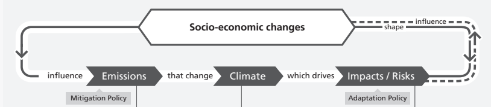
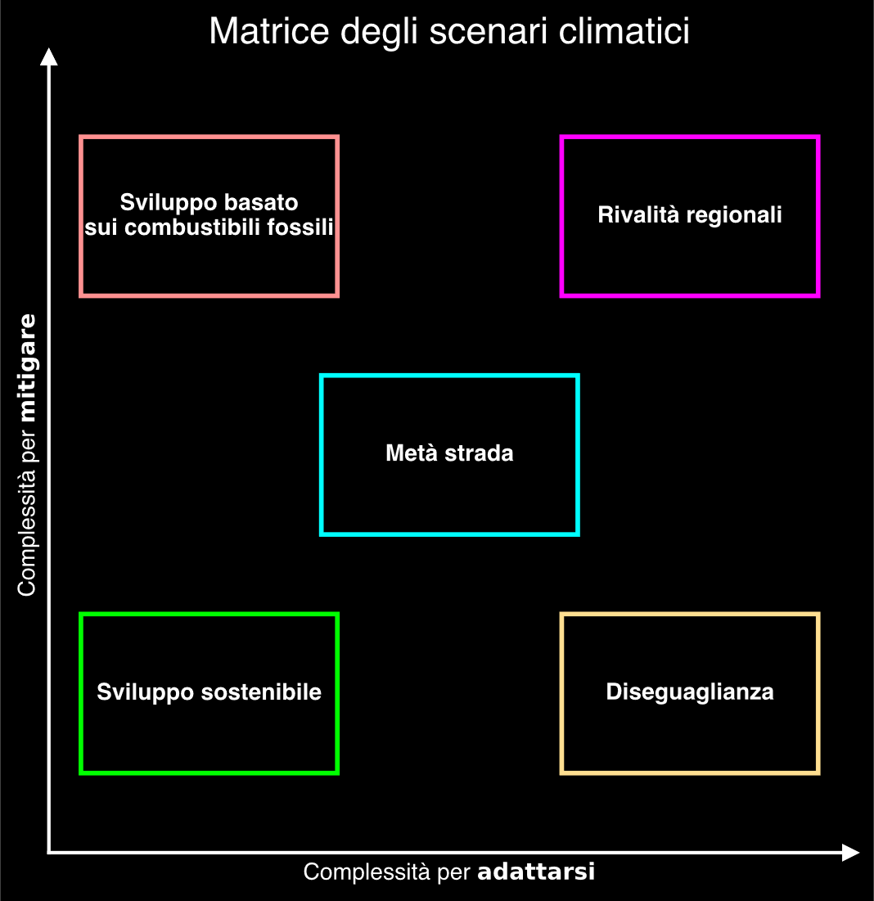
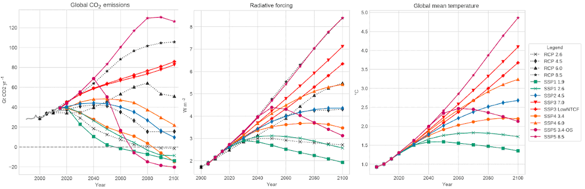
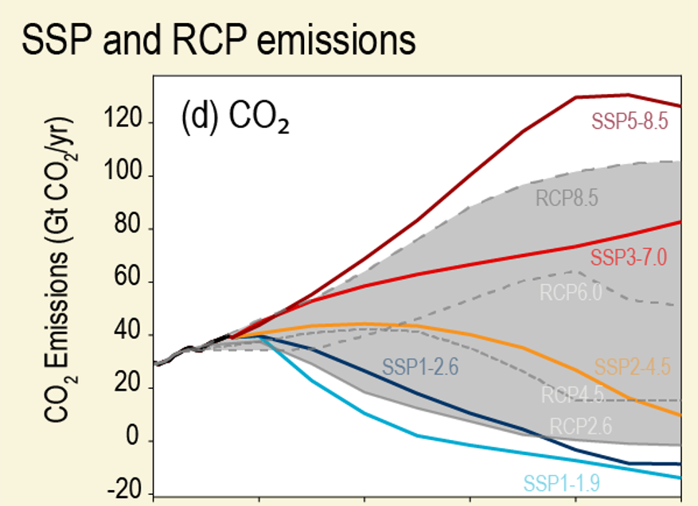
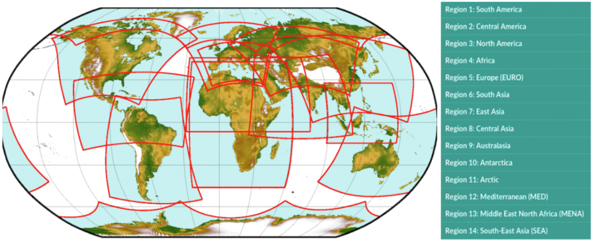
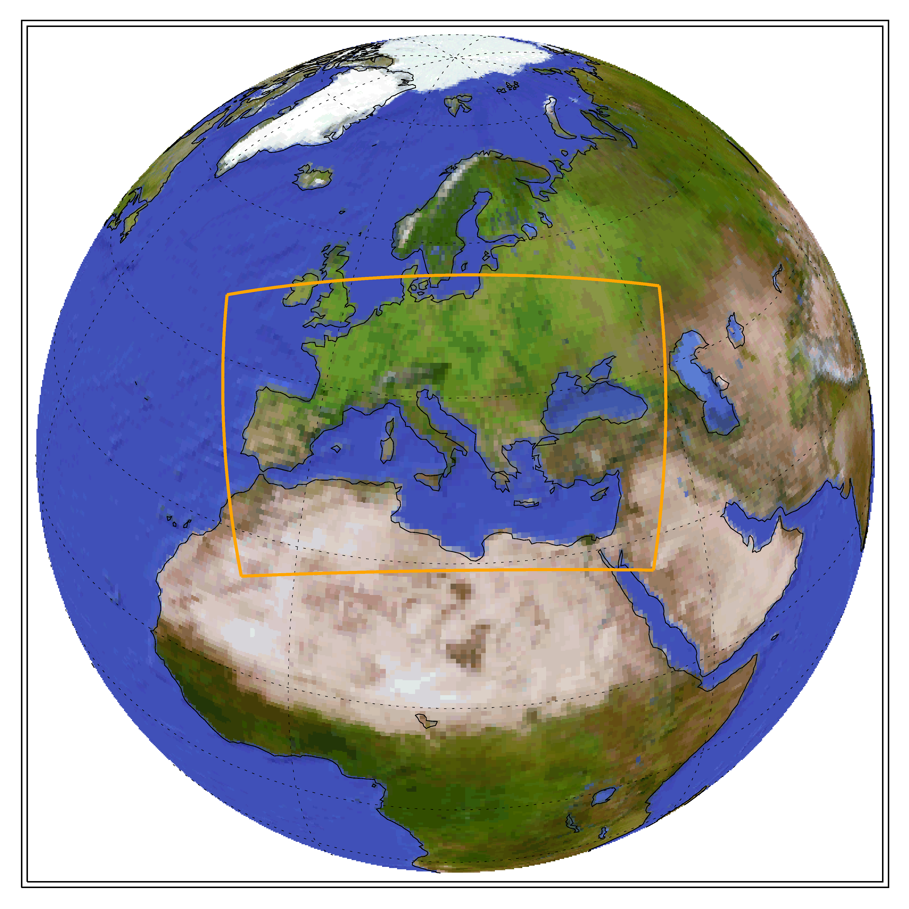

+++
title = 'SSP and RCP: a future story'
date = 2025-01-08T08:42:41+01:00
type = 'post'
+++

# Introduction

The [Intergovernamental Panel on Climate Change (IPCC)](https://www.ipcc.ch/) is the branch of the United Nations devoted to report the current and future status of climate change since 1990.

The Assessment Reports (ARs) synthetize the state of art of climate modelling of future scenarios: in AR5 the Representative Concentration Pathways (RCPs) were employed, in the latest AR6 the Shared Socio-economic Pathways (SSPs) are used.

These scenarios aren’t forecasts: their realization depends on the choice which will be taken by the whole human society. They’re limited in spatial resolution, as modelling the whole world meteorological variables on a such large timespan (nearly a whole century) is computationally very expensive. However, they prove themselves good at catching the higher level trends both in space and in time.

To catch trends at a higher spatial resolution, you need to look at the CORDEX simulations.

This page explains what RCPs and SSPs are and how they can help us in understanding the many possible evolutions of the climate in this century.

# Reference material

[IPCC Assessment Report 6, Synthesis, Longer report](https://www.ipcc.ch/report/ar6/syr/downloads/report/IPCC_AR6_SYR_LongerReport.pdf)

[AR6 Chapter 1.6](https://www.ipcc.ch/report/ar6/wg1/chapter/chapter-1/#1.6)

[SSPs cheatsheet by UNFCCC](https://unfccc.int/sites/default/files/part1_iiasa_rogelj_ssp_poster.pdf)

[CarbonBrief article on SSPs](https://www.carbonbrief.org/explainer-how-shared-socioeconomic-pathways-explore-future-climate-change/)

> 💡 Note that this page represents what I’ve understood about the topic and isn’t meant to be a reference. You can use it to ease your interpretation, but, please, refer to the official assessments and the many papers published on these topics.
Also, feel free to amend any erroneous statement! 🤗
> 

# RCPs

The Representative Concentration Pathways (RCPs) are the framework used in the AR5 to discern future scenarios.

## The radiative forcing

They are defined as `RCPx.x` where `x.x` denotes the radiative forcing in W/m2 which the atmosphere will have in 2100.

Usually, the considered scenarios are three, but there are more:

- RCP2.6
- RCP4.5
- RCP8.5

The higher the radiative forcing, the hotter the atmosphere and the more climate-change oriented the scenario (that is, more fossil fuels).

Why is the radiative forcing associated with a hotter world? Because when humans emit more greenhouse gases (CO2, CH4 and others), they influence the atmosphere so that it will accumulate more heat; it’s like a greenhouse with a thicker layer which release less heat.

## RCPs model climate

Only the climate variables are present in the RCPs. There’s no feedback loop on how the society will evolve. They model only the supposed mitigation efforts spent to contras the climate change.

## Timespan

Future projections of RCPs model the climate from 2006 to 2100.

You can notice there’s an overlapping part between their publication (in the 10’s) and their start year: the initial conditions provided to the models date few years before the moment they were produced. I can guess they needed consolidated data to initialize the model and they wanted to assess few years of the projections outputs against observed data.

A baseline part has been computed from 1850 to 2005. This is useful to assess the bias against historical data or reanalysis.

RCPs aren’t reanalysis nor consist of observed data; they’re simulations.

## Members

The [Coupled Model Intercomparison Project, phase 5 (CMIP5)](https://wcrp-cmip.org/cmip5/) is the framework under which the RCPs have been modelled. This framework standardizes the way contributing institution perform the modelling and provide the results.

Many are the institution which participated to the CMIP5, therefore many are the simulation results.

Also, within the same institution the physical model used to run the climate modelling or the initial conditions can be slightly changed, leading to more simulation results.

These simulations are usually called *members.*

## Datasets

The CMIP5 are available in the [CDS](https://cds.climate.copernicus.eu/datasets?q=cmip5) with many variants (monthly or daily data, single or pressure level).

# SSPs

The Shared Socio-economic Pathways are defined in the [Longer Synthesis report of AR6](https://www.ipcc.ch/report/ar6/syr/downloads/report/IPCC_AR6_SYR_LongerReport.pdf) in the Cross-Section Box.2.

## Framework

SSPs are defined as `SSPy-x.x` where `y` is the SSP scenario and `x.x` is the 2100 radiative forcing in W/m2.

The SSPs model the human society and economy to project 5 future scenarios (the `y` part). These scenarios are then linked to the climate through Integrated Assessment Models (IAMs); this models the feedback loop effect between climate and human activities and viceversa.

*Feedback loop between society changes and climate changes; from AR6, last figure of Section 2.*

It’s important to understand that these scenarios are *baseline* as they don’t include any climate policy. I repeat it: they include no climate change mitigation policy.
The transformation which will occur on the societal, energetic, economical sides will produce effects on the climate, different effects for each scenario.

Baseline scenario will lead to defined radiative forcing at the end of the century (the `x.x` part). This forcing represents a *final* *result*; no information about the forcing evolution is contained in the SSP definition; this is where SSPs differ from the RCPs, that is in the evolution during this century of the climate variables.

Each SSP scenario can lower its radiative forcing if effort is spent toward mitigate the climate change. Thus, a SSP scenario is associated to many final results: there are many `x.x` for each `y`.

## The SSP scenarios describe different future societies

Here’s a brief description of the 5 SSPs:

1. SSP1 Sustainability
    - many technological advancements
    - new energy capacity based on renewables
    - equal distribution of wealth
    - sensible decrease of global population
    - lower individual resource and energy consumption
2. SSP2 Middle of the Road
    - in the middle between the other four scenarios
3. SSP3 Regional Rivalry
    - surge of nationalisms and regional-only policies
    - unequal resource distribution
    - high societal, technological, welfare fragmentation
    - new energy capacity based on fossil fuels
    - political clashes
    - sensible increase in global population
4. SSP4 Inequality
    - unequal wealth distribution with poor development Countries and rich developed Countries
    - societal stratification and lack of societal cohesion
    - based on both fossil fuel and renewable
5. SSP5 Fossil-fueled Development
    - strong, harmonized global economical growth
    - new energy capacity based on fossil fuels
    - equal distribution of wealth
    - decrease in global population

The following matrix graphically explains the challenges these scenarios will face.

*SSP scenario matrix, courtesy of the author.*

## The mitigation policies lower the baseline radiative forcing

Each SSP has a baseline scenario: no climate change policy is brought to action. These are the most known scenarios: SSP1-2.6, SSP2-4.5 and SSP5-8.5. But they aren’t the only ones!

If effort will be spent toward mitigating the climate change, lower radiative forcings can be achieved in 2100 (for example, getting a SSP5-2.6 is possible!). This matrix provides a view of this dynamic:

![Scenario matrix specified by SSPs and forcing levels. Scenarios populate individual cells providing information about mitigation benefits and costs (shown here as example). It is distinguished between baseline scenarios without and mitigation scenarios with mitigation policies. The climate forcing in the baseline depends on the SSP, and only reaches RCP8.5 levels in SSP5. Stringent mitigation levels (RCP2.6) could not be accessed by a set of IAMs in SSP3.  I think this matrix is slightly outdated and that lower forcing levels can be achieved for certain scenarios, such as SSP1-1.9. Image from the SSP cheatsheet.](02_scenario_and_forcing_levels.png)
*Scenario matrix specified by SSPs and forcing levels. Scenarios populate individual cells providing information about mitigation benefits and costs (shown here as example). It is distinguished between baseline scenarios without and mitigation scenarios with mitigation policies. The climate forcing in the baseline depends on the SSP, and only reaches RCP8.5 levels in SSP5. Stringent mitigation levels (RCP2.6) could not be accessed by a set of IAMs in SSP3.  I think this matrix is slightly outdated and that lower forcing levels can be achieved for certain scenarios, such as SSP1-1.9. Image from the SSP cheatsheet.*

Of course, the lower the target radiative forcing, the more the effort to mitigate climate change.

Sometimes, some radiative forcing are simply impossible to get because they’d require too much effort which is socially and technologically unfeasible to achieve.
For example, SSP5-2.6 is achievable due to the many technological advancements which are supposed to happen in that SSP.
On the other hand, SSP3-2.6 is unrealistic due to the societal fragmentation and the poor technological advancements.

## SSPs have more information than RCPs

RCPs model climate only; SSPs model climate and human society. You can now understand that RCPs model only the mitigation efforts.

While the final radiative forcing matches for some scenarios, SSPs’ trajectory of climate variables is different when compared to RCPs. If I plotted the radiative forcing from SSP5-8.5 and RCP8.5 I’d get two different curves, but approximately with the same value in 2100. See the [Section 4.6.2.2 of the AR6](https://www.ipcc.ch/report/ar6/wg1/chapter/chapter-4/#4.6.2.2) for more details.

*RCP vs SSP comparison taken from [NOAA](https://psl.noaa.gov/ipcc/cmip6/exper.html).*

*CO2 emissions of SSP scenarios and RCP scenarios taken from [the Cross-Chapter Box.2 image 2 in the AR6, chapter 1](https://www.ipcc.ch/report/ar6/wg1/figures/chapter-1/ccbox-1-4-figure-2). Note the different trajectories of the emissions in the scenarios with the same radiative forcing.*

[Section 4.2.2 of AR6](https://www.ipcc.ch/report/ar6/wg1/chapter/chapter-4/#4.2.2) states:

> Complete backward comparability between CMIP5 and CMIP6 scenarios cannot be established for detailed regional assessments, because the SSP scenarios include regional forcings – especially from land use and aerosols – that are different from the CMIP5 RCPs. Even at a global level, a quantitative comparison is challenging between corresponding SSP and RCP radiative forcing levels due to differing contributions to the forcing and evidence of differing model responses.

## Timespan

SSPs future projections span from 2016 to 2100.

## Dataset

The CDS provides the [CMIP6 data](https://cds.climate.copernicus.eu/datasets/projections-cmip6?tab=overview).

[CMIP6](https://wcrp-cmip.org/cmip6/) is the next phase after the CMIP5; thus they have many simulation members from many institutions and many realizations.

# And the CORDEX?

[Coordinated Regional Climate Downscaling Experiment (CORDEX)](https://cordex.org/) is the project aiming to downscale the CMIP5 and CMIP6 outputs.

They get domains around the world (for example Europe), they use the CMIP data as boundary conditions and they obtain a spatially finer version of the projections.

*CORDEX domains.*

*EURO-CORDEX domain.*

The resolution improvement is of one order of magnitude: from around 1 deg to around 0.1 deg.

As far as I know, CORDEX are available only referred to the CMIP5 outputs; thus, no SSP is present in actual CORDEX datasets 😟

[Data is available in the CDS](https://cds.climate.copernicus.eu/datasets/projections-cordex-domains-single-levels).